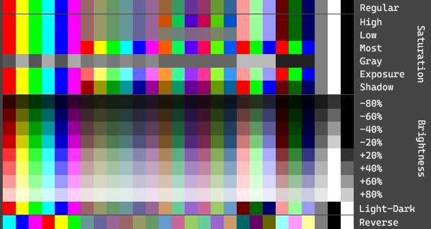
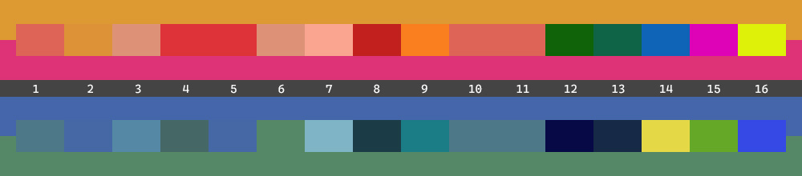

# 颜色

颜色调整、转换、解析和混合。

在 `Trivial.Drawing` [命名空间](../) 中。

## 调整



通过以下方法调整颜色。

- 白平衡（变亮和变暗）
- 切换亮度（在浅色模式和深色模式之间）
- 不透明度
- 饱和度滤镜和灰度
- 旋转色相
- 使用特定通道
- 色彩平衡
- 反转

```csharp
var color = System.Drawing.Color.FromArgb(0xCC, 0x99, 0x33);

// 变亮。
ColorCalculator.Lighten(color, 0.1);

// 不透明度。
ColorCalculator.Opacity(color, 0.9);

// 饱和度滤镜
var color = ColorCalculator.Parse("hsl(318.413, 76.518%, 0.51568)");
color = ColorCalculator.Saturate(color, 0.2);

// 自适应饱和度滤镜
color = ColorCalculator.Saturate(color, RelativeSaturationLevels.High);
```

## 解析器

从包含十六进制、RGB(A)、HSL 或 CMYK 的字符串解析。

```csharp
var hex = ColorCalculator.Parse("#FFFF0000");
var rgb = ColorCalculator.Parse("rgb(226, 37, 0xA8)");
var hsl = ColorCalculator.Parse("hsl(318.413, 76.518%, 0.51568)");
var cmyk = ColorCalculator.Parse("cmyk(0, 0.83628, 0.25664, 0.11373)");
```

## 转换器

转换为以下颜色系统。

- HSL (色相-饱和度-亮度)
- HSV (色相-饱和度-值)
- HSI (色相-饱和度-强度)
- CMYK (青-品红-黄-黑)
- CIE LAB (亮度和两个色度)
- CIE XYZ

```csharp
var color = Color.FromArgb(0xCC, 0x99, 0x33);
var (h, s, l) = ColorCalculator.ToHSL(color);
var (c, m, y, k) = ColorCalculator.ToCMYK(color);
var (l, a, b) = ColorCalculator.ToCIELAB(color);
```

或者从 HSL 或 CMYK 转换。

```csharp
var hsl = ColorCalculator.FromHSL(318.413, 0.76518, 0.51568);
var cmyk = ColorCalculator.FromCMYK(0, 0.83628, 0.25664, 0.11373);
```

## 覆盖

在另一种颜色（基色）上覆盖一种颜色（混合色）。

```csharp
color = ColorCalculator.Overlay(
    Color.FromArgb(0.7, 240, 0, 0),
    Color.FromArgb(0, 240, 0));
```

或者在覆盖之前为混合色设置额外的不透明度。

```csharp
color = ColorCalculator.Overlay(
    Color.FromArgb(240, 0, 0),
    0.7,
    Color.FromArgb(0, 240, 0));
```

# 混合

将两种颜色混合以生成一种新的颜色。



上图显示了灰色条两侧的两个示例，带有白色索引。

- 混合 `#EEDD9933` 橙色和 `#FFDD3377` 玫瑰/红色。
- 混合 `#EE4466AA` 蓝色和 `#FF558866` 绿色。

每种使用以下不同的混合类型（`enum ColorMixTypes`）来显示结果。

1. `Normal`: 平均每个通道。就像两种颜料混合在一起。
2. `Cover`: 混合色的图层覆盖基色的图层。
3. `Lighten`: 通过最大值合并每个通道。就像两束光照在同一个地方。
4. `Darken`: 通过最小值合并每个通道。就像两个光学滤镜重叠。
5. `Wetness`: 通过最小值或最大值合并每个通道。因此新颜色的饱和度值将与合并的颜色一样高。
6. `Dryness`: 通过中间值合并每个通道。因此新颜色的饱和度值将与合并的颜色一样低。
7. `Weaken`: 颜色线性减淡。就像两束光相互增强。
8. `Deepen`: 颜色线性加深。就像两个光学滤镜重叠并有额外的损失。
9. `Emphasis`: 强调每个通道。如果基色中的通道大于灰色，则进行颜色减淡；否则，进行颜色加深。
10. `Accent`: 将混合色和基色的每个通道相加。然后覆盖以适应。
11. `Add`: 将混合色和基色的每个通道相加。然后包含以适应。
12. `Remove`: 通过基色移除混合色的每个通道值。
13. `Diff`: 绝对差异混合色和基色的每个通道。
14. `Distance`: 循环差异混合色和基色的每个通道。
15. `Symmetry`: 对混合色和基色的每个通道进行对称处理。
16. `Strengthen`: 将混合色的每个通道从基色中平移相同的间距并覆盖以适应。

以下是一个示例程序。

```csharp
color = ColorCalculator.Mix(
    ColorMixTypes.Normal,
    Color.FromArgb(240, 0, 0),
    Color.FromArgb(0, 240, 0));

color = ColorCalculator.Mix(
    ColorMixTypes.Lighten,
    Color.FromArgb(0xEE, 0xDD, 0x99, 0x33),
    Color.FromArgb(0xDD, 0x33, 0x77));

color = ColorCalculator.Mix(
    ColorMixTypes.Accent,
    Color.FromArgb(0xEE, 0x44, 0x66, 0xAA),
    Color.FromArgb(0x55, 0x88, 0x66));
```

# 线性渐变

通过起始颜色和结束颜色创建指定数量的颜色以用于线性渐变。

```csharp
var colors = ColorCalculator.LinearGradient(
    Color.FromArgb(0xCC, 0x99, 0x33),
    Color.FromArgb(0x33, 0x66, 0xCC),
    20
);
```
