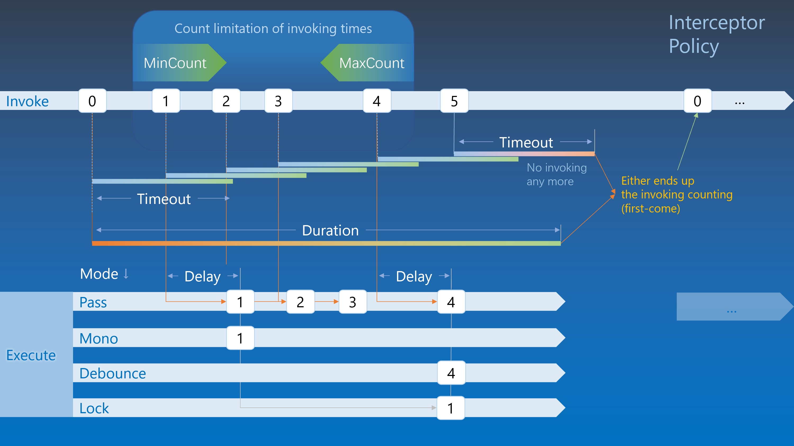

# 并发拦截器

你可以为特定的操作设置并发任务拦截器以控制其执行。

在 `Trivial.Tasks` [命名空间](../) 中。

### 防抖

如果需要在短时间内多次请求调用特定操作，但只有最后一次应该被处理，之前的请求将被忽略。一个示例场景是实时搜索。

```csharp
var action = Interceptor.Debounce(() => {
    // 执行某些操作…
}, TimeSpan.FromMilliseconds(200));

// 在某处调用。
action();
```

### 节流

如果希望在短时间内即使多次请求调用某个操作，也只处理一次。其余的请求将被忽略。

```csharp
var action = Interceptor.Throttle(() => {
    // 执行某些操作…
}, TimeSpan.FromMilliseconds(10000));

// 在某处调用。
action();
```

### 连击

可以定义一个操作只能在特定次数范围内被处理，其他的将被忽略。一个示例场景是双击。

```csharp
var action = Interceptor.Times(() => {
    // 执行某些操作…
}, 2, 2, TimeSpan.FromMilliseconds(200));

// 在某处调用。
action();
```

### 多次

一个处理程序，用于在特定次数内处理操作，并在一段时间后重置。

```csharp
var action = Interceptor.Multiple(() => {
    // 执行某些操作…
}, 10, null, TimeSpan.FromMilliseconds(200));

// 在某处调用。
action();
```

### 完全控制与概念

可以创建一个名为 `InterceptorPolicy` 的策略来确定何时可以执行调用的操作。
它包含以下属性来设置匹配条件。

- 调用次数的限制。因此我们可以设置一个可选的最小计数和一个可选的最大计数作为允许调用操作的窗口。
- 计数持续时间和超时以自动重置。它用于在从第一次或最后一次调用开始的特定时间间隔后将上述调用次数重置为零。
- 延迟时间以调用。
- 拦截器模式以确定在上述调用次数限制中哪个被调用，例如第一个、最后一个或全部。

然后使用操作和策略初始化 `Interceptor` 或其泛型类的实例。



实际上，上述预设的并发拦截器是通过 `InterceptorPolicy` 的属性设置的。
