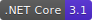
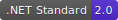

# Trivial libraries

Trivial libraries contain a lot of utilities, models and components, which are trivial but useful, to help you to focus on the business logic of your projects.

## [Trivial](./docs/core)

A library providing lots of useful utilities, models and services,
including hit task, retry policy, writable JSON DOM, PEM, JWT, stream combination, JSON HTTP web client, CSV parser, JSON converter, numerals, coordinates, angle, arithmetic, sets, etc.

- [Task and retry policy](./docs/tasks)
- [Text (also including JSON and CSV)](./docs/text)
- [Data](./docs/data)
- [Maths and numerals](./docs/maths)
- [Network](./docs/net)
- [Security](./docs/security)
- [File and stream](./docs/io)
- [Collection](./docs/collection)
- [Reflection](./docs/reflection)
- [Geography](./docs/geo)

## [Trivial.Chemistry](./docs/chemistry)

Includeing the basic chemistry models.

- [Chemistry](./docs/chemistry)

## [Trivial.Console](./docs/console)

The useful utilities for console application including command dispatcher, arguments parser and some rich UX CLI controls.

- [Console utilities and components](./docs/console)

## [Trivial.Web](./docs/web)

The useful utilities for ASP.NET application.

