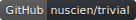

# 

Trivial libraries contain a lot of utilities, models and components, which are trivial but useful, to help you to focus on the business logic of your projects.

### Trivial

This library includes utilities and services for tasks, security, JSON, etc.

- [Task and retry policy](./tasks/)
- [Text (also including JSON and CSV)](./text/)
- [Network](./net/)
- [Security and authentication](./security/)
- [Data](./data/)
- [File and stream](./io/)
- [Maths and numerals](./maths/)
- [Reflection](./reflection/)
- [Colors](./drawing/)
- [Geography](./geo/)
- [Command line](./cmdline/)

### Trivial.Chemistry

Including the periodic table and basic chemistry models, e.g. chemical element, molecular formula and isotope.

- [Chemistry](./chemistry)

### Trivial.Messages

Chat message and accessories.
The MIME constants and its mapping of file extension part.
Also provide Code-128 and EAN parser supports.

- [MIME constants](./web/mime)
- [EAN](./data/ean)
- [Code 128 and GS1-128](./data/code128)

### Trivial.Web

The useful utilities for ASP.NET application.

- [ASP.NET utilities](./web/controller)

### Trivial.Console

The rich user controls of command line interface.

- [Console components](./cmdline/controls)
