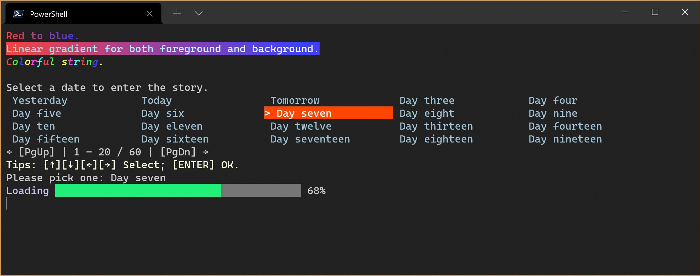

# CommandLine

In `Trivial.CommandLine` namespace of `Trivial.dll` [library](../).
Some useful utilities for console application.

- [Arguments](./arguments) An instance provided a way to access values from the arguments and dispatch the command verbs.
- [CLI](./console) An adaptive command line interface for both terminal and command prompt.

In `Trivial.CommandLine` namespace of `Trivial.Console.dll` library.
A lot of useful rich command line controls.



- [Selection](./selection) A visual console control that allow user select item by pressing keyboard.
- [Progress bar](./progress) A visual console control that update the state of a task.
- [Prettier](./prettier) The text prettier.
- [Data formatter](./data) Format and output object like JSON object, JSON array, exception, etc.

# `Trivial.Console` library

The rich user interface console controls for terminal and Command Prompt.

This library targets .NET 6, .NET 5, .NET Core 3.1, .NET Standard 2.0, .NET Framework 4.6.1 and .NET Framework 4.8.

You can install the package from [NuGet](https://www.nuget.org/packages/Trivial.Console) to your project.

```sh
PM > Install-Package Trivial.Console
```
