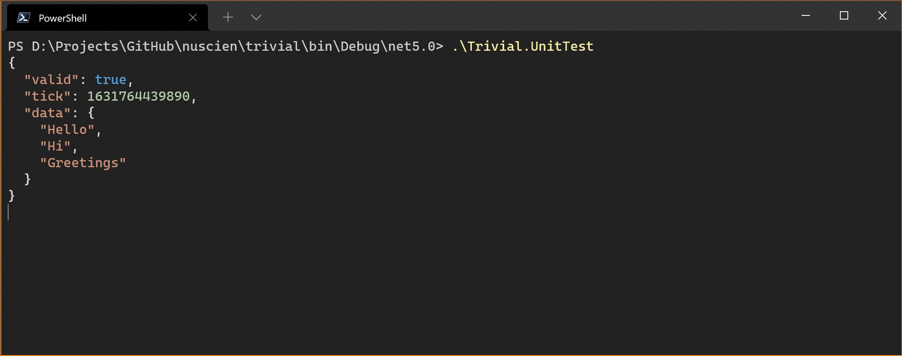

# Data Formatter

Format and output the struct to terminal.

In `Trivial.CommandLine` [namespace](../) of `Trivial.Console.dll` [library](../../).

## JSON



Following is a sample to format JSON into command line app.

```csharp
var json = new Trivial.Text.JsonObjectNode();
// and then add some properties to json.
DefaultConsole.WriteLine(json);
```

This is not available for Command Prompt.

## Exception

Following is a sample to format an exception into command line app.

```csharp
var ex = new InvalidOperationException();
DefaultConsole.WriteLine(ex);
```

## Customize

To customize a data model formatter, need implement the interface `IConsoleTextCreator<T>`.
Following is an example to convert a date time to both string and JavaScript tick with optional foreground color.

```csharp
using Trivial.Web;
public class JsTickConsoleStyle : IConsoleTextCreator<DateTime>
{
    public ConsoleColor? StringColor { get; set; }
    public ConsoleColor? TickColor { get; set; }

    public IEnumerable<ConsoleText> CreateTextCollection(string s)
    {
        List<ConsoleText> col = new();
        col.Add(WebFormat.ToString(), new ConsoleTextStyle(StringColor));
        col.AddEmptyLine();
        col.Add(WebFormat.ParseDate(s).ToString(), new ConsoleTextStyle(TickColor));
        return col;
    }
}
```

Now we can use this to output as we expect.

```csharp
var style = new JsTickConsoleStyle { TickColor = ConsoleColor.Green };
DefaultConsole.WriteLine(style, DateTime.Now);
```
