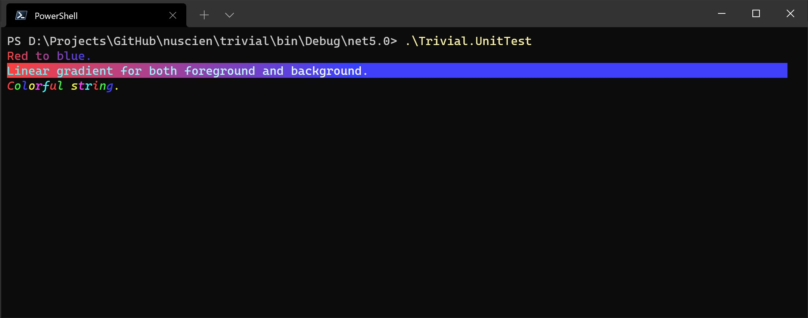

# Prettier

The console text prettier.

In `Trivial.CommandLine` [namespace](../) of `Trivial.Console.dll` [library](../../).



## Linear Gradient

Following is a sample to output linear gradient text to terminal.

```csharp
DefaultConsole.WriteLine(new LinearGradientConsoleStyle(
    ConsoleColor.Red, // Fallback color
    System.Drawing.Color.FromArgb(250, 64, 64),  // From color
    System.Drawing.Color.FromArgb(64, 64, 250))     // To color
{
    Bold = true
}, "Red to blue.");
```

This also supports background.

```csharp
DefaultConsole.WriteLine(new LinearGradientConsoleStyle(
    ConsoleColor.Gray, // Fallback foreground color
    System.Drawing.Color.FromArgb(64, 250, 250), // From foreground color
    System.Drawing.Color.FromArgb(240, 240, 240), // To foreground color
    null,  // Fallback background color
    System.Drawing.Color.FromArgb(250, 64, 64),   // From background color
    System.Drawing.Color.FromArgb(64, 64, 250) // To background color
), "Linear gradient for both foreground and background.");
```

## Repeated Color

This is used to output a text of that each character has a specific color.

```csharp
DefaultConsole.WriteLine(new RepeatedColorConsoleStyle(
    new[] { // Fallback foreground colors
        ConsoleColor.Red,
        ConsoleColor.Green,
        ConsoleColor.Blue
    },
    new[] { // Foreground colors
        System.Drawing.Color.FromArgb(250, 64, 64),
        System.Drawing.Color.FromArgb(64, 250, 64),
        System.Drawing.Color.FromArgb(64, 64, 250),
        System.Drawing.Color.FromArgb(250, 250, 64),
        System.Drawing.Color.FromArgb(250, 64, 250),
        System.Drawing.Color.FromArgb(64, 250, 250)
    })
{
    Italic = true
}, "Colorful string.");
```

## Customize

To customize a prettier, you can implement the interface `IConsoleTextPrettier`.
Following is an example to make text italic and set a specific foreground color.

```csharp
public class DemoPrettier : IConsoleTextPrettier
{
    public ConsoleColor Color { get; set; }

    public IEnumerable<ConsoleText> CreateTextCollection(string s)
    {
        List<ConsoleText> col = new();
        col.Add(s, new ConsoleTextStyle(Color) { Italic = true });
        return col;
    }
}
```

Now we can use this to output as we expect.

```csharp
var style = new DemoPrettier { ConsoleColor.Red };
DefaultConsole.WriteLine(style, "Red italic text.");
```
