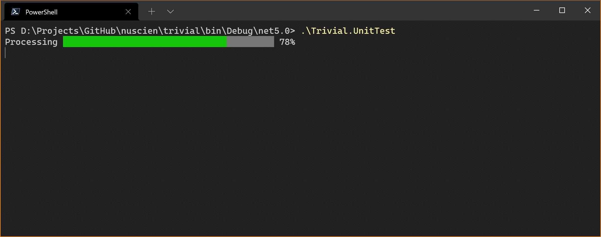

# Progress bar

It can present the latest state during the specific task running.

In `Trivial.CommandLine` [namespace](../) of `Trivial.Console.dll` [library](../../).



## Control

You can output a progress bar to update during a task running.

```csharp
// Define an options that you can custom the style.
var progressStyle = new ConsoleProgressStyle
{
    ValueConsoleColor = ConsoleColor.Gray
};

// Ouput the component in console and get the progress instance to update.
var progress = DefaultConsole.WriteLine(progressStyle, "Processing");

// A time-consuming work here.
for (var i = 0; i <= 50; i++)
{
    await Task.Delay(10);

    // And report the progress updated.
    progress.Report(0.02 * i);
}
```
