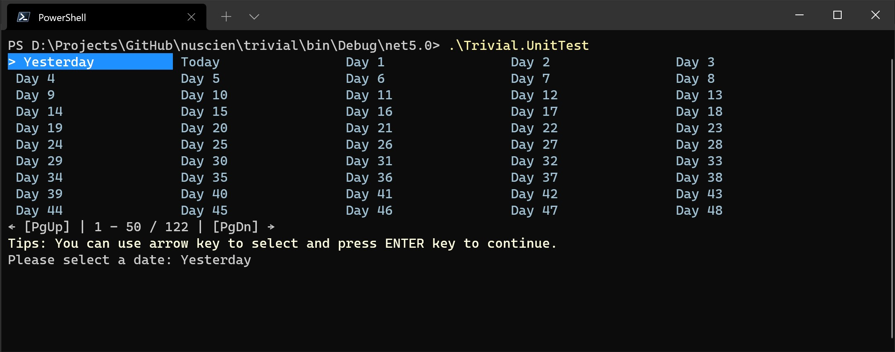

# Selection

A beautiful list or table with customized style to the standard output stream 
so that user just need press the arrow buttons and `ENTER` in keyboard to select.

In `Trivial.CommandLine` [namespace](../) of `Trivial.Console.dll` [library](../../).



## Control

When you have lots of item need user to select one to continue coming logic,
you need prepare this data into a model.
Each item includes a display name and raw data.

```csharp
// Create an instance for adding items and setting options.
var col = new Trivial.Collection.SelectionData<DateTime>();

// Add some items. For each item, you can set a hotkey, a display name and the data.
col.Add('y', "Yesterday", DateTime.Now.Date.AddDays(-1));
col.Add('t', "Today", DateTime.Now.Date);
for (var i = 0; i < 120; i++)
{
    col.Add($"Day {i + 1}", DateTime.Now.Date.AddDays(i));
}
```

Then you can custom the style of the selection control which we will output later.

```csharp
// Create an options for display.
var options = new SelectionConsoleOptions
{
    // You can define a question string after the list.
    Question = "Please select a date: ",

    // We can define the colors of the item selected.
    SelectedForegroundConsoleColor = ConsoleColor.White,
    SelectedForegroundRgbColor = System.Drawing.Color.White,
    SelectedBackgroundConsoleColor = ConsoleColor.Blue,
    SelectedBackgroundRgbColor = System.Drawing.Color.DodgerBlue,

    // The selected item will also be displayed after the question string.
    // So you can define its color.
    ItemForegroundConsoleColor = ConsoleColor.Gray,
    ItemForegroundRgbColor = System.Drawing.Color.FromArgb(160, 192, 212),

    // At the end of the list, the tips will be displayed before user press any key.
    // There is a default value and you can customize it.
    // And you can disable it by set it as null.
    Tips = "Tips: You can use arrow key to select and press ENTER key to continue.",

    // Then you can define its color.
    TipsForegroundConsoleColor = ConsoleColor.Yellow,
    TipsForegroundRgbColor = System.Drawing.Color.LightYellow,

    // You can define the prefix for the item and the one selected.
    SelectedPrefix = "> ",
    Prefix = " ",

    // You can define the column count for the list.
    Column = 5,

    // You can define the maximum rows to displayed.
    // A paging will be displayed if the count of the list is greater than it.
    MaxRow = 10,

    // Press ESC can cancel this selection.
    // But you can enable the manual way by set a manual question
    // so that user can type the words directly.
    ManualQuestion = "Type: "
};
```

Now output it and get the result.

```csharp
// Write it to the standard output stream and wait for user selection.
var result = DefaultConsole.Select(col, options);

// You can get the result.
DefaultConsole.WriteLine("The result is {0}.", result.Value);
```

## Shortcut Keys

User can press following keys to interact with the control and select one.

| Key | Description |
| -------- | ----------------------------------- |
| `←` | Move cursor to previous item (left column) |
| `→` | Move cursor to next item (right column) |
| `↑` | Move cursor to previous row |
| `↓` | Move cursor to next row |
| `Home` | Move cursor to the first item in the page |
| `End` | Move cursor to the last item in the page |
| `PgUp` | Turn to previous page |
| `PgDn` | Turn to next page |
| `Enter` | OK (select the current one) |
| `Spacebar` | OK (select the current one) |
| `Esc` | Abort |
| `Backspace` | Switch to manual typing mode |
| `F1` | Get help |
| `F4` | List all data and switch to maunal typing mode |
| `F5` | Refresh (and back to the 1st if also press `Ctrl`) |
| `F6` | Re-output (and back to the 1st if also press `Ctrl`) |
| Hotkey | Select the item registered with the hotkey |
