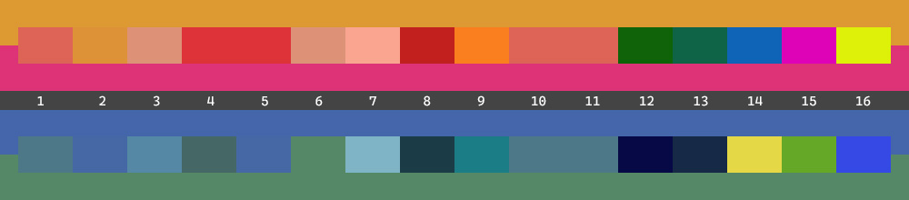

# Color

Color adjustment, converter, parser and mixer.

In `Trivial.Drawing` [namespace](../) of `Trivial.dll` [library](../../).

## Adjustment


Adjust colors by following methods.

- White balance (lighten and darken)
- Toggle brightness (between light mode and dark mode)
- Opacity
- Saturation filter and grayscale
- Rotate hue
- With specific channel(s)
- Color balance
- Reverse

```csharp
var color = System.Drawing.Color.FromArgb(0xCC, 0x99, 0x33);

// Lighten.
ColorCalculator.Lighten(color, 0.1);

// Opacity.
ColorCalculator.Opacity(color, 0.9);

// Saturation filter
var color = ColorCalculator.Parse("hsl(318.413, 76.518%, 0.51568)");
color = ColorCalculator.Saturate(color, 0.2);

// Self-adaptation saturation filter
color = ColorCalculator.Saturate(color, RelativeSaturationLevels.High);
```

## Parser

Parse from a string with content of hex, RGB(A), HSL or CMYK.

```csharp
var hex = ColorCalculator.Parse("#FFFF0000");
var rgb = ColorCalculator.Parse("rgb(226, 37, 0xA8)");
var hsl = ColorCalculator.Parse("hsl(318.413, 76.518%, 0.51568)");
var cmyk = ColorCalculator.Parse("cmyk(0, 0.83628, 0.25664, 0.11373)");
```

## Converter

Convert to following color systems.

- HSL (hue-saturation-lightness)
- HSV (hue-saturation-value)
- HSI (hue-saturation-intensity)
- CMYK (cyan-magenta-yellow-black)
- CIE LAB (lightness and 2 chromaticities)
- CIE XYZ

```csharp
var color = Color.FromArgb(0xCC, 0x99, 0x33);
var (h, s, l) = ColorCalculator.ToHSL(color);
var (c, m, y, k) = ColorCalculator.ToCMYK(color);
var (l, a, b) = ColorCalculator.ToCIELAB(color);
```

Or convert from HSL or CMYK.

```csharp
var hsl = ColorCalculator.FromHSL(318.413, 0.76518, 0.51568);
var cmyk = ColorCalculator.FromCMYK(0, 0.83628, 0.25664, 0.11373);
```

## Overlay

Overlay a color (blend color) on another (base color).

```csharp
color = ColorCalculator.Overlay(
    Color.FromArgb(0.7, 240, 0, 0),
    Color.FromArgb(0, 240, 0));
```

Or set an additional opacity to the blend color before overlay.

```csharp
color = ColorCalculator.Overlay(
    Color.FromArgb(240, 0, 0),
    0.7,
    Color.FromArgb(0, 240, 0));
```

# Mix

Mix 2 colors to result a new one.



Above shows 2 examples on both sides of the gray bar with white indexes.

- Mix `#EEDD9933` orange and `#FFDD3377` rose/red.
- Mix `#EE4466AA` blue and `#FF558866` green.

Each uses following different mix types (`enum ColorMixTypes`) to show result.

1. `Normal`: Average each channel. Like 2 pigments mix together.
2. `Cover`: The layer of the blend color covers the layer of the base color.
3. `Lighten`: Merge each channel by the maximum value. Like 2 lights shine the same place.
4. `Darken`: Merge each channel by the minimum value. Like 2 optical filters overlap.
5. `Wetness`: Merge each channel by the minimum value or maximum value. So the saturation value of the new color will be as higher as the one merged.
6. `Dryness`: Merge each channel by the middle value. So the saturation value of the new color will be as lower as the one merged.
7. `Weaken`: Color linear dodge. Like 2 lights increase each other.
8. `Deepen`: Color linear burn. Like 2 optical filters overlap with additional loss.
9. `Emphasis`: Emphasize each channel. Color dodge if the channel in base color is greater than gray; otherwise, color burn.
10. `Accent`: Add each channel of the blend color and the base color. Then cover to fit.
11. `Add`: Add each channel of the blend color and the base color. Then contain to fit.
12. `Remove`: Remove each channel value of the blend color by the base color.
13. `Diff`: Diff absolutely each channel of the blend color by the base color.
14. `Distance`: Diff cycled each channel of the blend color by the base color.
15. `Symmetry`: Symmetry each channel of the blend color by the base color.
16. `Strengthen`: Translate each channel of the blend color away from the base color with same gap and cover to fit.

Following is a sample to program.

```csharp
color = ColorCalculator.Mix(
    ColorMixTypes.Normal,
    Color.FromArgb(240, 0, 0),
    Color.FromArgb(0, 240, 0));

color = ColorCalculator.Mix(
    ColorMixTypes.Lighten,
    Color.FromArgb(0xEE, 0xDD, 0x99, 0x33),
    Color.FromArgb(0xDD, 0x33, 0x77));

color = ColorCalculator.Mix(
    ColorMixTypes.Accent,
    Color.FromArgb(0xEE, 0x44, 0x66, 0xAA),
    Color.FromArgb(0x55, 0x88, 0x66));
```

# Linear gradient

Create a specific number of color by a from color and an end color for linear gradient.

```csharp
var colors = ColorCalculator.LinearGradient(
    Color.FromArgb(0xCC, 0x99, 0x33),
    Color.FromArgb(0x33, 0x66, 0xCC),
    20
);
```
