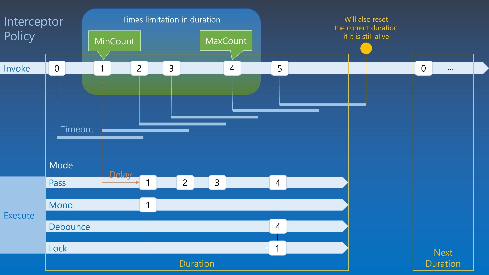

# Interceptor

You can set an action with a specific interceptor to control its execution.

In `Trivial.Tasks` [namespace](../) of `Trivial.dll` library.

### Debounce

You may request to call a specific action several times in a short time but only the last one should be processed and previous ones should be ignored.
A sample scenario is real-time search.

```csharp
var action = Interceptor.Debounce(() => {
    // Do something...
}, TimeSpan.FromMilliseconds(200));

// Somewhere to invoke.
action();
```

### Throttle

You may want to request to call an action only once in a short time even if you request to call several times. The rest will be ignored.

```csharp
var action = Interceptor.Throttle(() => {
    // Do something...
}, TimeSpan.FromMilliseconds(10000));

// Somewhere to invoke.
action();
```

### Times

You can define an action can be only processed only when request to call in the specific times range and others will be ignored.
A sample scenario is double click.

```csharp
var action = Interceptor.Times(() => {
    // Do something...
}, 2, 2, TimeSpan.FromMilliseconds(200));

// Somewhere to invoke.
action();
```

### Multiple

A handler to process for the specific times and it will be reset after a while.

```csharp
var action = Interceptor.Multiple(() => {
    // Do something...
}, 10, null, TimeSpan.FromMilliseconds(200));

// Somewhere to invoke.
action();
```

### Full control & Concept

You can create a policy named `InterceptorPolicy` to determine when the invoking action can be executed.
It contains following properties to set the condition to match.

- Limitation of invoking times. So we can set an optional minimum count and an optional maximum count as a window to allow the invoking actions.
- The counting duration and timeout to auto reset. It is used to reset the above invoking times to zero after a specific time span from the first or last invoking.
- Delay time span to invoke.
- The interceptor mode to determine which one invokes in the above invoking times limitation, e.g. the first one, the last one or all.

Then initialize an instance of `Interceptor` or its generic class with the action and policy.



In fact, the above preset interceptors are set with the properties of `InterceptorPolicy`.
